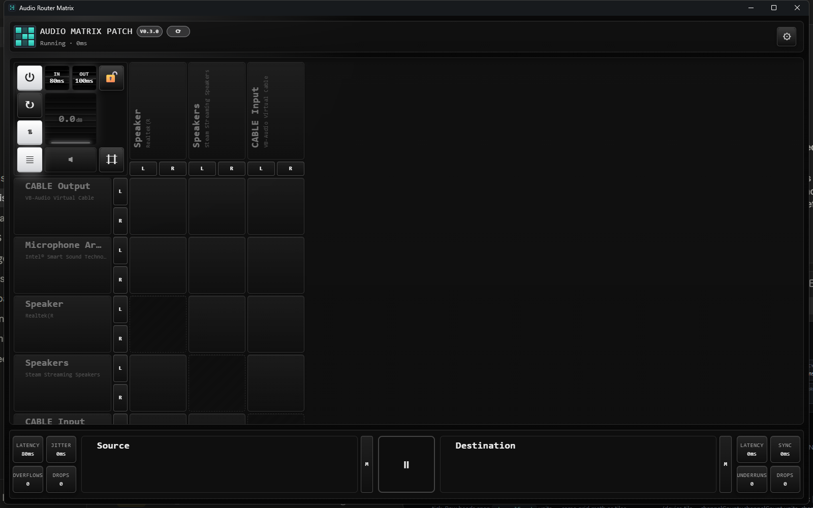

# Design Reference — Audio Matrix Router UI

Ground truth for the Avalonia migration. Screenshots in `docs/design/` are captured from
the real running app (v0.3.0, default theme: `black` background, Consolas font, MD scale);
every value below is taken verbatim from `AudioMatrixRouter/WebUI/src/index.css`.

---

## 1. Design language in one paragraph

Dark **rack-hardware skeuomorphism**: every interactive element is a physical "key" — a
raised face lit from the top, seated in a dark chassis. The lighting model is exactly two
inset strokes (`--fx-edge`: 1px white @ 10% on top, 1px black @ 38% on bottom) over a
vertical face gradient (surface +7% white → surface −16% black). Pressing inverts the
lighting (`--fx-press`: inset 0 2px 6px black @ 55%). Type is the user-selected preset
(default Consolas — monospace matters to the look), uppercase with letter-spacing for
titles/labels. One accent color does all the talking; everything else is near-black
neutrals.

## 2. Tokens

### Colors (default `black` background preset + theme system)
| Token | Value | Role |
|---|---|---|
| `--bg` | `#101113` | window background (plus radial accent glow at top-left, 16% mix, fading by 32%) |
| `--surface` / `--panel` | `#1a1d22` | raised faces / panel chassis |
| `--line` | `#39404d` | borders; `--line-strong` = line + 14% white |
| `--text` | `#dbe0e8` | primary; `--text-strong` = +8% white; `--muted` = `#9aa4b2` |
| `--accent` | `#2dd4bf` | THE color: active tiles, meters, master badges, glows |
| `--accent-hl` | `#77f0df` | bright end of every accent gradient |
| `--phase` | `#8b5cf6` | phase-inverted routes (purple diagonal stripes) |
| `--danger` | `#ef4444` | mute state, destructive |
| `--text-on-accent` | bg 82% + black 18% | dark text on lit tiles |

**Theme system:** 7 background presets × 7 accent presets × 7 fonts × 7 sizes × 7 UI
scales, all swapping CSS variables. In Avalonia these become a `ThemeService` that
computes the derived mixes (`color-mix()` has no XAML equivalent — precompute in code:
`mix(a, b, w) = a*w + b*(1-w)` per channel) and updates `DynamicResource` brushes.

### Geometry
| Token | Value |
|---|---|
| Device tile (`.cell`) | **112 × 112 px — always square** |
| Channel cell | (112 − 4) / 2 = **54 px — the atomic square unit** |
| Grid gap | 4 px |
| Channel chip strip | **28 px** short side; each chip's **long side = one channel unit (54 px = half a device tile)**, so chips align 1:1 with the tile channel lanes. Chips are DETACHED — own border each, 4 px gaps, transparent strip; the device card's border never wraps them |
| Radii | panel 8 / overlay 6 / tile 5 / micro (chips, meter bars) 4 |
| Label square | source column **width == destination header height**, one shared value (`labelSizing`), clamped 140–360, both resize handles write the same number → **the corner settings box is always square** |
| UI scale | whole root `transform: scale()` — geometry derives from the unit, never hardcode scaled values |

### Motion
| What | Value |
|---|---|
| Interaction transitions | `120ms cubic-bezier(0.2, 0.85, 0.25, 1)` (`--fx-fast`) |
| Meter bar width/height | `70ms linear` |
| Drum rotation | `background-position 80ms ease-out` |
| Hover lift | `translateY(-1px)` + stronger drop shadow; press `translateY(+1px)` + `--fx-press` |

---

## 3. Components

### 3.1 Topbar (`design/app-header.png`)
- Brand: 3×3 grid of 6px accent squares (alternating 85%/35% opacity), title
  `font-size-md` uppercase `letter-spacing: 0.06em`, status line muted `xs`
  ("Running · 12.4ms" / "Standby").
- Version pill: min 46×22, radius 999, border `accent 48% + line`, bg `accent 16% +
  surface`, text 92% + accent-hl, `2xs × 0.92` weight 700.
- Update button: same pill recipe + hover border `accent 72%`; actionable state
  (update available / ready) brightens to `accent 34%` bg with `--accent-hl` text.
- **Migration note:** this row becomes the title bar — caption buttons (— ▢ ✕) join at
  the far right; empty space = drag region.

### 3.2 Corner control block (`design/app-corner.png`)
A 4×4 grid filling the corner square. Layout map (col,row): power (1,1) · IN drum (2,1)
· OUT drum (3,1) · lock (4,1) · reload (1,2) · input-mode (1,3) · **master gain drum
(2–3, 2–3)** · show-all (1,4) · mute (2–3, 4) · view toggle (4,4).

- Buttons: `.corner-control-btn` — the canonical "key": face gradient (surface +8% white
  → panel −14% black), `--fx-edge` + elevation, plus an extra top-light overlay (inset
  1px, white 12% → 0). Active = accent-face key (accent-hl 84% + white → accent 92% +
  black) with dark text and accent glow. Muted = red-tinted face. Icon size `xl`.
- **Drum controls** (gain wheel + both buffer drums) — the signature element. Recessed
  housing: `#050505` bg, border `line 50% + black`, deep inset shadows top+bottom
  (`inset 0 ±5px 14px rgba(0,0,0,.85)`), outer accent glow (28% idle → 52% hover).
  Ribbed drum texture, **12px per rib**: 0–1px deep groove · 1–3px highlight crest ·
  3–9px mid ridge body · 9–11px shadowed slope · 11–12px dark gap — scrolled vertically
  by drag/wheel (24px per 0.5dB step; 10px per 5ms buffer step). Barrel curvature
  overlay: dark 80% at top/bottom edges → white 7% at center. **Accent LED strip** at
  bottom: 2px tall, 12% side insets, radius 999, accent-hl @ 90% with double glow.
  Value floats over: `lg` weight 800 with heavy dark text-shadow, unit `2xs` @ 72%.
- **Avalonia:** one `DrumControl` (custom `Control`) reused ×3; ribs are a
  `DrawingContext` tiled gradient offset by the drag accumulator.

### 3.3 Column headers (`design/app-corner.png`, bottom strip)
- Grid: `rows: 1fr 28px; gap 4px` — label box above, **detached** channel chip strip below.
- Label box: `.rack-panel` chassis; device name `sm` strong + hardware sub-label `2xs`
  muted, both `writing-mode: vertical-rl` rotated 180° (reads bottom-up), anchored to
  the bottom-left, 6px gap between name and sub, ellipsis truncation.
- Meters behind the label (z-order: meter 1, text 2): one **vertical bar per channel**,
  bottom-aligned, `linear-gradient(0deg, accent 20% → accent-hl 32%)` (transparent
  base — the bar is a tinted glass overlay, not a solid), radius 4, 4px gap and padding,
  height animates 70ms linear. Bars sit at ~full opacity; the *transparency is in the
  gradient*, which is why they read as glow, not paint.
- **MASTER badge — a 20px accent-lit EDGE BAR, not a corner chip.** (Caveat: the badge
  is absent from the reference screenshots — no master was set during capture — so this
  spec comes straight from `.master-badge` / `.master-badge-col` / `.master-badge-row`
  in the CSS.) Column cards: full-width bar on the card's BOTTOM edge, 20px tall.
  Row cards: full-height bar on the LEFT edge, 20px wide, text `vertical-rl` rotated
  180° (reads bottom-up). Face = the lit-key recipe (accent-hl 84% + white 16% →
  accent 92% + black 8%), text `--text-on-accent` `2xs` weight 800 letter-spacing 0.12em,
  inner top light 34% / bottom shade 24%, accent drop glow. The master card itself also
  gets an accent ring (`.master-axis`: border accent 78% + white, inset accent stroke,
  accent glow) — badge and ring always appear together.
- **Badge corners:** the badge's OUTER corners follow the card radius; its INNER corners
  are square — row badge: top-left/bottom-left rounded, top-right/bottom-right square;
  col badge: bottom-left/bottom-right rounded, top-left/top-right square. (In the web
  app this falls out of the card's `overflow: hidden`; in Avalonia draw it explicitly.)
- **Badge occupies its footprint.** Content AND the meter layer inset by 24px
  (badge 20 + 4 gap) on the badge's edge — the bars stop at the badge, never run under
  it. (This was a live bug in the web app: card padding reserved 18px for a 20px badge
  and the absolutely-positioned meter layer ignored padding entirely; fixed in
  `index.css` via the `.master-axis` / `:has(.detail-master-badge)` inset rules.)
- Channel chips (`.axis-split-cell`): each is its own mini-key — micro radius, strong
  border, key-face gradient + `--fx-edge` shadow; label (`L`/`R`/`1..n` or `M` for mono)
  `2xs` weight 800 in `accent-hl 76% + text 24%`.
- **Chip geometry rule:** the header cell is a transparent container splitting into
  `device card (1fr) + 4px gap + 28px chip strip`. Each chip is a separate bordered
  element sized 54 × 28 (cols) / 28 × 54 (rows) — long side = **half a device tile =
  one channel unit** — so chip N sits exactly on channel lane N of the tiles beside it.
  Never fuse chips into a strip and never draw the card border around them.

### 3.4 Row headers (`design/app-rows.png`)
- Grid: `columns: 1fr 28px; gap 4px` — label box left, chip column right.
- **Label at the TOP**: name `sm` strong + sub-label `2xs` muted anchored top-left
  (`justify-content/align-items: flex-start`), 8px stack gap, ellipsis. The label
  floats over the meters (text z 2, meters z 1) — never vertically centered.
- Meters behind: one **horizontal bar per channel**, and each bar **fills its entire
  tile-lane height** — the meter area is `repeat(channels, 1fr)` rows with only 4px
  padding and 4px gaps, so a stereo card is two ~50px-tall bars stacked, not thin
  strips. Fill `linear-gradient(90deg, accent 22% → accent-hl 32%)` (translucent glass,
  the card face shows through), **border-radius 4px on the bars themselves**, width
  animates 70ms linear.
- Chip column distributes one chip per channel (`1fr` each) so chips always align with
  the channel rows of the tiles beside them.
- Inactive device (no routes): entire header drops opacity. Master device: 20px MASTER
  edge bar on the card's left edge (see §3.3) + accent ring; card content and meters
  inset to clear the bar.

### 3.5 Tiles (`design/app-rows.png`)
The `.cell` states, verbatim:
| State | Spec |
|---|---|
| off | key-face gradient, `line-strong` border, radius 5, **opacity 0.62**, `--fx-edge` + `0 6px 12px black 22%` |
| hover | lift −1px, border `accent 50% + line`, deeper shadow, `saturate(1.05)` |
| **on** | border `accent 84% + white`; face `accent-hl 72% + white 28% → accent 86% + black 14%` (top-lit lit key); shadows: inner top white 18%, inner bottom black 20%, **glow** `0 0 10px accent 45%` + `0 12px 20px accent 14%`; opacity 1 |
| selected (hover-tracked) | border `accent-hl 58%`; when a selection exists, all *other* cells dim (off ~0.45, on ~0.8) — the hover row/col "path" (`path-left`/`path-up`) stays brighter, drawing an L to the crosspoint |
| blocked (loopback self-route) | dashed border, opacity 0.5, 135° hatch (8px stripes, two surface-black mixes) |
| phase-inverted | purple: border `--phase 72% + white`, 135° purple stripes @ 16–20% over the face, inner+outer purple glow; combines with `on` |
| muted | red-shifted face (danger-soft mixes) |
| gain readout | centered `2xs` weight 700, dark-on-accent text + 1px dark text-shadow, only shown when abs(gain) ≥ 0.5dB |

**The square law:** a tile is *always* a square multiple of the 54px unit — channel view
1×1, device view `inputChannels` tall × `outputChannels` wide (2ch × 8ch = 2×8 units;
each unit square, spans free). In Avalonia the whole matrix is ONE custom control; UNIT
is a single constant; hit-testing is integer division on the unit grid.

### 3.6 Dock (`design/app-dock.png`)
Five columns: `metrics(fixed) | source card(*) | route indicator(fixed) | destination
card(*) | metrics(fixed)` — **the flexible width belongs to the cards, never the
metric boxes.**
- Metric tiles: 2×2 group of small keys; label `2xs` uppercase muted on top, value
  strong mono below. Left group: Latency / Jitter / Overflows / Drops (input side).
  Right group: Latency / Sync / Underruns / Drops (output side).
- Cards mirror the row-header recipe exactly: device name + sub anchored **top-left**
  over **full-card horizontal meters** (`.card-meter-bg-row-split` — one bar per
  channel, each filling its whole lane height with 4px pad/gaps, radius 4, glass
  gradient); channel chips (`L`/`R`/`M`…) sit in **their own detached 20px column
  beside the card**, one bordered mini-key per channel (`.detail-channels-outside` +
  `.axis-split-cell`) — never inside the card border; MASTER badge = the same 20px
  vertical edge bar on the card's left edge (`.detail-master-badge`), occupying its
  footprint per §3.3. Cards show the hovered route's devices, falling back to the
  master pair.
- Route indicator: square key between the cards — `🡢` active (accent), `⮆` for
  multichannel fan-out, `⏸` inactive.

### 3.7 Panels & background
- `.rack-panel`: line border, radius 8, vertical translucent gradient + `backdrop-blur
  8px`, inner top light 4%, `0 8px 24px` drop. (Avalonia: skip real blur — panels sit on
  a flat dark bg; a slightly translucent solid reads identically here.)
- Window bg: `radial-gradient(circle at 10% 0%, accent 16% → transparent 32%)` over
  `linear-gradient(180deg, bg → bg 82% + black)` — the subtle teal aurora top-left is
  part of the identity, keep it.

---

## 4. Known glyph inventory (replace with icon paths in Avalonia)
`⏻ 🔒 🔓 🔈 ↻ ≣ ⌗ ⚙ 🎤 🔊 ⥮ 🡢 ⮆ ⏸ ✕ — ▢ ⟳ …` — Skia text rendering of mixed
emoji/dingbats is inconsistent; ship these as `StreamGeometry` icons styled with the
same foreground brushes so they weight-match the type.
